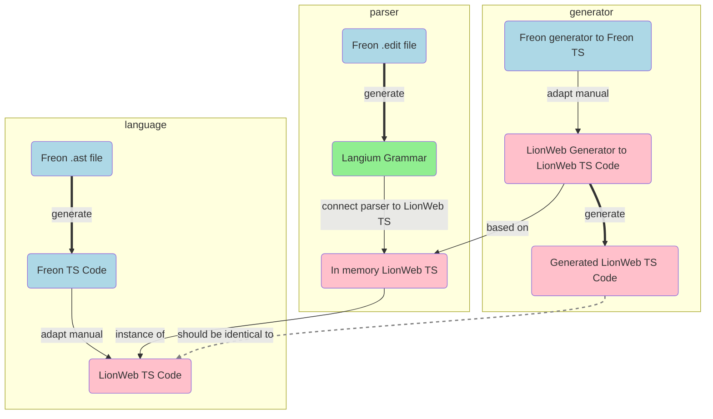

# How to move to 100% LionWeb

## Only take the good parts that we want and need.

- The core generated TypeScript code, including mobx is working perfectly.
- The grammar / parser generator
- The scoper is really cool
- etc.    

## Make M3 /.ast file 100 percent compatible with LionWeb

Remove
- Limiteds no longer objects using references, but just values
- No multiple property values

Add
- Annotations

Change
- ModelUnits become (special) Concepts, like partitions in LionWeb.

## Roadmap

### Bootstrap AST
- From existing lioncore_m3 .ast files: generate the TypeScript code for the LionCore M3 language. (M3-TS)
  - Manually write the code for enumerations

- From existing lioncore_m3 .edit files: Generate langium grammar for the LionCore M3 language. (M3-LG)

- Parse language textfile using M3-LG resulting in an im memory TypeScript model using M3-TS. (C)

- Rebase Freon generator (Freon meta package) on C. D
  - Generate TypeScript code for LionCor_M3 using D => compare with M3-TS
  - This should result in the same code.

After these steps we have 
- a TypeScript LionCore-M3,
- a syntax + parser that parses a language definition creating an in  memory TypeScript language model.
- a generator that generates TypeScript for a language from its in memory TypeScript model.

### Bootstrap Parser
- adapt the .edit file to fit the M3-TS
- adapt the parser generator to use the M3-TS as basis

- we can now generate a parser from the M3-TS based .edit file

### Bootstrap Projectional editor
- adapt the editor generator to the M3-TS 

### Bootstrap Scoper
We need to
- adapt the scoper to work on the M3-TS.
- integrate the scoper into the Langium scoper API.

### Bootstrap Overview

Legend: **Blue**: Already there from Freon, **Green**: Working on it, **Pink**: Final goal

Once nwe have this working for the M3 level, it also works for the m2 level,
so it is a nice language development IDE.

## Open Questions
- Going from text <=> lionweb json format should be trivial.
  Having an unparser (adapted version from Freon) is usefull, might even add this as a pretty-printer to the IDE.
  We need to decide in which cases which format is leading, as they both can be stored.
  Potentially we can store the textual format information in annotations, need a PoC for this

- Probably rethink the textual format for the LionCore-M3 language, as it is rather verbose now with keywords like "mandatory" etc.

- Refactor the LionWeb TS generator to generate code per language, which can
  be combined at runtime

## Wild Future Ideas
- develop a diagrammatic editor.
-  

