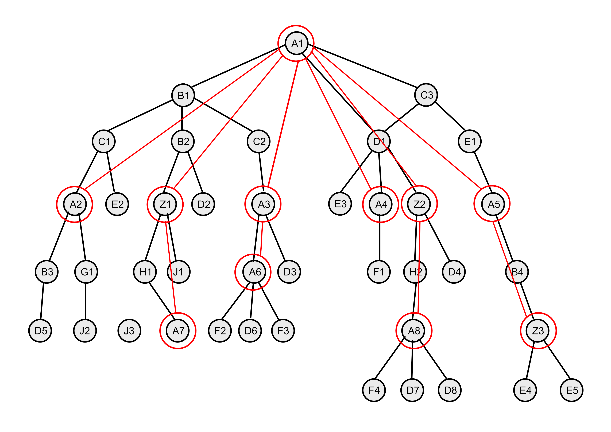
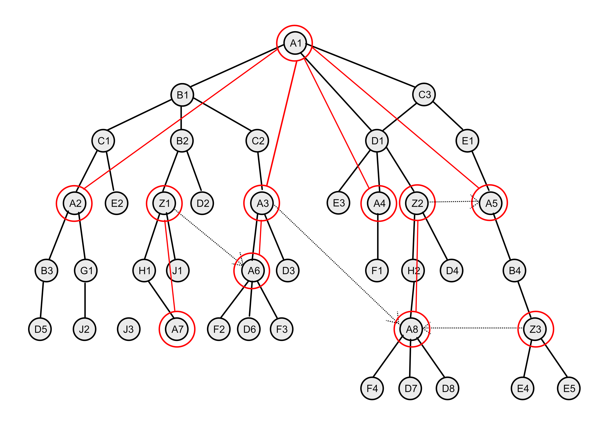

# The Freon Approach to Scoping

Scoping in Freon is based on namespaces. The theory behind this is the 
scope graph theory that was developed at Delft University by Eelco Visser e.a.
(Reference!)

## The Namespace Tree and the Abstract Syntax Tree
In Freon you can declare that certain types of abstract syntax nodes are namespaces. A namespace is 
the container that holds of a set of declarations of named AST nodes. 

All namespaces together form a tree. This tree is similar to, but not equal to the AST. The namespace tree 
is an overlay over the AST, where some nodes in the AST are namespaces, and some are not.

The following figure shows an abstract syntax tree, where all nodes are named. In this example, if the name 
equals A1, then the node is of type A, if it equals H4, then the node is of type H, etc.


We now declare that all nodes of type A and Z are namespaces, as shown in the following figure. The namespaces are 
colored red.



When we look at the namespaces only, the following tree appears.


The declared named nodes in a namespace are all named nodes in the AST from the namespace node 
to any child namespace node. Thus, we can determine the set of declared nodes in any namespace in our example.
The declared nodes of namespace A1, for instance, are the nodes B1, C3, C1, B2, C2, D1, E1, A2, E2, 
Z1, D2, A3, E3, A4, Z2, and A5. Whereas namespace Z2 holds as declared nodes the set of H2, D4, and A8.

### How to define namespaces in Freon

In Freon you can state that certain types of nodes are namespaces. This in done in the .scope file 
using the following syntax. 

`isNamespace { A, Z }`

## DeclaredNodes and VisibleNodes

The set of named nodes that are visible in a namespace (called '_VisibleNodes_') is not equal to the named nodes that 
are declared in that namespace (called '_DeclaredNodes_'). Most of the time the set of visible names is larger. The reason is 
that namespaces are hierarchical, that is, the named nodes that are declared in the parent namespace are also visible 
in the child namespace. On the other hand, the parent namespace does not know the named nodes from the 
child. (Note that the parent namespace does know the name of the child namespace itself.)

For instance, in the above example, the DeclaredNodes in A8 are [F1, D7, D8], whereas the VisibleNodes include also the 
DeclaredNodes from Z2 and A1: [F1, D7, D8, H2, D4, A8, B1, C3, C1, B2, C2, D1, E1, A2, E2,
Z1, D2, A3, E3, A4, Z2, A5]. 

### Shadowing

In case a name appears in the DeclaredNodes of a child namespace as well as in its parent namespace, the name from the 
parent is not included in the VisibleNodes of the child.

## Adapting the Namespace Tree

There are three ways in which the namespace tree can be changed.

1. Additions
2. Replacements (or Alternatives)
3. Exports (to be implemented)

## Namespace Additions

Any namespace can be augmented with the set of names that are declared in another namespace.
Note, only the DeclaredNodes of the second namespace are added, not the whole set of VisibleNodes.
A namespace addition makes the namespace tree actually a graph, like references make a graph from the AST.

For instance, when in the AST a reference is added from node A3 to node A8, we can include 
the DeclaredNodes of A8 ([F1, D7, D8]) in the VisibleNodes of A3.


### How to Define Namespace Additions in Freon

Suppose the reference to A8 is known in the type of A as a property called `imports`. The .ast file would have
an entry like this:

`concept A {
    ...
    imports: A[];
    ...
}`

Then in the .scope file we can define the namespace-addition as follows. Note that you can only add a node that is declared
to be a namespace. So in this example, we could only use a property of type A or Z, or lists of A or lists of Z.

`A {
    namespace_addition = self.imports;
}
`

## Namespace Replacements

It is also possible to break out of the namespace hierarchy. This done by declaring an alternative or replacement
namespace. In the hierarchical tree the 
link of the namespace with its parent is removed, and a link to another namespace is made. This second namespace 
takes over the role of the parent, with the exception that only the DeclaredNodes are included, not the 
complete set of VisibleNodes.

For instance, suppose the Z concept is defined to have a reference to an A concept, held in a property called `myA`. 
We can then use this property instead of the parent namespace of Z. Suppose, furthermore, that node Z1 has a reference 
to node A6, as shown in the following figure. In that case, the DeclaredNodes of Z1 
are [H1, J1, A7], and its VisibleNodes are [H1, J1, A7, A6, F1, D6].



When we leave out the AST nodes, the difference to the namespace graph will become more clear.


### How to Define Namespace Replacements in Freon

To define the alternative or replacement namespace in Freon, use the following syntax.

`Z {
	namespace_replacement = self.myA; // used to be 'scope = self.myA'
}`

## Namespace Exports 
(To be implemented!)

As explained, a parent namespace does not know the named nodes from any
child namespace. However, any namespace can break the hiding of (some of) its DeclaredNodes 
by stating that such a declaration is public. This means that the declared named 
node is visible in the parent namespace. The parent namespace may re-export the declaration, but need not.

In the above example the namespace A6 may declare F3 to be public. In that case, the VisibleNodes of 
namespace A3 will include [A6, D3, F3], next to all of the DeclaredNodes of its parent A1.

### How to Define Namespace Exports in Freon
(Proposal!)

In the .ast file the concept A must be declared to have a property of type F, for instance as follows.

`concept A {
    ...
    myF: F;
    ...
}`

Then in the .scope file, this property can be declared public or exported, like this, where 
'export' is a keyword:

`A {
	export self.myF;
}`

## What are Qualified Names in Freon?

Having established the above framework for scoping, the subject of qualified names need to be addressed.
Qualified names are only relevant when referring to a node. If the referred node is in the same namespace 
as the reference, its single name suffices. But when the node is in another namespace as the reference, 
its qualified name can used to better distinguish which node is referred to. 

The qualified name of a 
node is determined by prefixing the single name with the name(s) of the namespace(s)
the node is declared in. For example, the node D6 in the depicted AST has the qualified name 'A1.A3.A6.D6'
Note that the qualified name is always determined based on the namespace hierarchy, without taking 
additional or replacement namespaces into account.

Qualified names as shown in Freon in the dropdown menu for references as the single name postfixed by the 
word 'from' followed by the start of the qualified name. For instance 'D6 from A1.A3.A6'. The separator used
(here '.') can be set in the .edit file. (Proposal!)

## The Expression for a Namespace Addition or Replacement

(Still in development!)

In Freon you can denote a single namespace by using an expression over the AST. This expression in general
can be one of the following.

1. An expression denoting an instance of a limited concept, for instance `#BasicConcepts:StringConcept`.
2. An expression denoting a node in the AST using the path from a start node to this node, for instance `self.myA.myB.myC`.
3. An expression denoting a special meta-level function. For the scoper the only function currently
   available is `typeof`, which should get a single node as parameter, or the keyword `container`. The node can be
   denoted using an expression of type 1 or 2. An example is `typeof(self.myH)`. When you use the keyword `container`
   as parameter, the typer definition is taken into account. The result of the expression `typeof(container)` is the
   type found by the typer for the node that is the direct parent of `self` in the AST.

In the scope definition any of these expressions should result in a node that is a namespace.

When defining a namespace replacement only one expression can be used. When defining a namespace addition a number of
these expression can be combined using a plus sign. For instance, the following scope definition is valid, iff the paths
conform to the AST definition.

```
A {
	namespace-addition = self.myF + self.myG.myH + self.myE.imports.myD;
}

Z {
    namespace_replacement = typeof(self.myA); // used to be 'scope = typeof(self.myA)'
}
```
