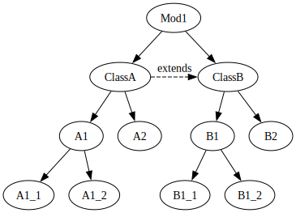
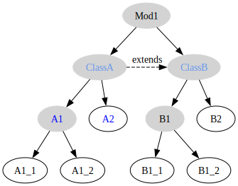
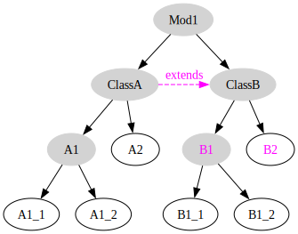
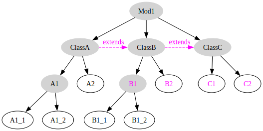

# ## Example Modules with Classes

### Language and AST

This example show a language with Modules containing Classes containing Properties. The Freon .ast files looks as follows:

```proto
modelunit Module {
    name: identifier
    classes: Class[];
}
concept Class {
    name: identifier;
    features: Features[];
    reference extends: Class;
}
abstract concept Feature {
    name: identifier;
}
concept Property {
}
concept Method {
    parameters: Parameter[];   // don't care what this type is exactly
}
concept Parameter {
    name: identifier;
}
```

We have the following AST for this language in speudo text:

```Java
module Mod1
 class ClassA extends ClassB
   method A1 (parameter A1_1, parameter A1_2)
   property A2
 class B 
   method B1 (parameter B1_1, parameter B1_2)
   property B2
```

The AST looks as follows:


### Defining Namespaces

The first step is to define which of the nodes in the AST are namespaces. We do this in the `.scope` file as follows:

```proto
isnamespace { Module, Class, Method }
```

The AST now looks as follows.  The grey nodes are namespaces, because they are instances of Module, Class or Method.  The nodes with blue names are the *visible nodes* od namespace *ClassA*.



The sets of nodes for some of the namespaces is show below. Note that the vbisible nodes is simply the union of the declared and parent nodes.

```dot
ClassA: declaredNodes = [A1, A2]
        parentNodes   = [ClassA, ClassB]
        importedNodes = []                   // coming later
        visibleNodes  = A1, A2, ClassA, ClassB

ClassB declaredNodes = [B1, B2] 
       parentNodes   = [ClassA, ClassB]
       importedNodes = []
       visibleNodes  = [B1, B2, ClassA, ClassB]

Mod1 declaredNodes   = [ClassA, ClassB]
     fromParentNodes = []
     additionalNodes = []
     visibleNodes    = [ClassA, ClassB]

A1: declaredNodes = [A1_1, A2_2]
    parentNodes   = [A1, A2, ClassA, ClassB]. // up to the root namespace
    importedNodes = []                   
    visibleNodes  = A1_1, A1_2, A1, A2, ClassA, ClassB
```

Inside the Method *A1*, we should be able to refere to inherited features B1 and B2 of the superclass *ClassB*. Bur, as you can see in the table, B1 and B2 are not visible inside A1, so you cannot refer to them.

To solve this, we use the notion of importing namespaces.

### Import Namespaces

A namespaces can have one or more \*import \*relationships to other namespaces. This is specified in the `.scope` file as follows:

```proto
Class {
    imports {
       self.extends
    }
}
```

This is only valid if both *Class* and the resulting node(s) of evaluating the `self.extends` expression are namespaces.

The above means that for each instance of concept *Class* the namespace is importing all *declared nodes* from the namespace that `self.extends` is pointing to.

In the following AST the parts participating in the import are show in the color magenta. First the `extends` reference from class *ClassA* is now an import of namespace *ClassA*. As a result the *declared nodes* from *ClassB* are now visible inside namespace *ClassA*.

We redefine the **visible nodes** of A1 as the *declared nodes of A1* + the *parents declared nodes* + the *parents imported nodes*.



lala

```dot
ClassA: declaredNodes = [A1, A2]
        parentNodes   = [ClassA, ClassB]
        importedNodes = [B1. B2]
        visibleNodes  = A1, A2, B1, B2, ClassA, ClassB

A1: declaredNodes = [A1_1, A2_2]
    parentNodes   = [A1, A2, ClassA, ClassB, B1, B2]
    importedNodes = []                   
    visibleNodes  = A1_1, A1_2, A1, A2, B1, B2, ClassA, ClassB
```

Since B1 and B2 are now visible inside namespace A1, we can refer to then inside method *A\_1*.

### Recursive Imports

We now extends pour model by adding *ClassC* with two properties *C1* and *C2* and we make *ClassB* extend *ClassC*. We then get the following AST.



*ClassC* is a Class and therefore a namespace and it has two *declared nodes*: *C*1 and *C2*.

The `extends` reference from ClassB to ClassC is an import that imports the nodes from ClassC into the *ClassB*.

```dot
ClassA: declaredNodes = [A1, A2]
        parentNodes   = [ClassA, ClassB, ClassC]
        importedNodes = [B1. B2]
        visibleNodes  = A1, A2, B1, B2, ClassA, ClassB, ClassC

ClassB: declaredNodes = [B1, B2]
        parentNodes   = [ClassA, ClassB, ClassC]
        importedNodes = [C1, C2]
        visibleNodes  = B1, B2, ClassA, ClassB, ClassC, C1, C2 

ClassC: declaredNodes = [C1, C2]
        parentNodes   = [ClassA, ClassB, ClassC]
        importedNodes = []
        visibleNodes  = C1, C2, ClassA, ClassB, ClassC

A1: declaredNodes = [A1_1, A2_2]
    parentNodes   = [A1, A2, ClassA, ClassB, ClassC, B1, B2]
    importedNodes = []                   
    visibleNodes  = A1_1, A1_2, A1, A2, B1, B2, ClassA, ClassB, ClassC
```

As you can see, the properties of ClassC are not visible in ClassA, although they shopuld be according to the inheritance from *ClassA* to *ClassB* to *ClassC*.

We can solve this in the scope file by specifying that we want the namespace import to be recursive like in:

```proto
Class {
    imports {
       self.extends recursive
    }
}
```

Now all imports of *ClassB* are added to the visible names of *ClassA*.

```dot
ClassA: declaredNodes = [A1, A2]
        parentNodes   = [ClassA, ClassB, ClassC]
        importedNodes = [B1, B2, C1, C2]
        visibleNodes  = A1, A2, B1, B2, C1, C2, ClassA, ClassB, ClassC


A1: declaredNodes = [A1_1, A2_2]
    parentNodes   = [A1, A2, ClassA, ClassB, ClassC, B1, B2]
    importedNodes = []                   
    visibleNodes  = A1_1, A1_2, A1, A2, B1, B2, C1, C2, ClassA, ClassB, ClassC
```

