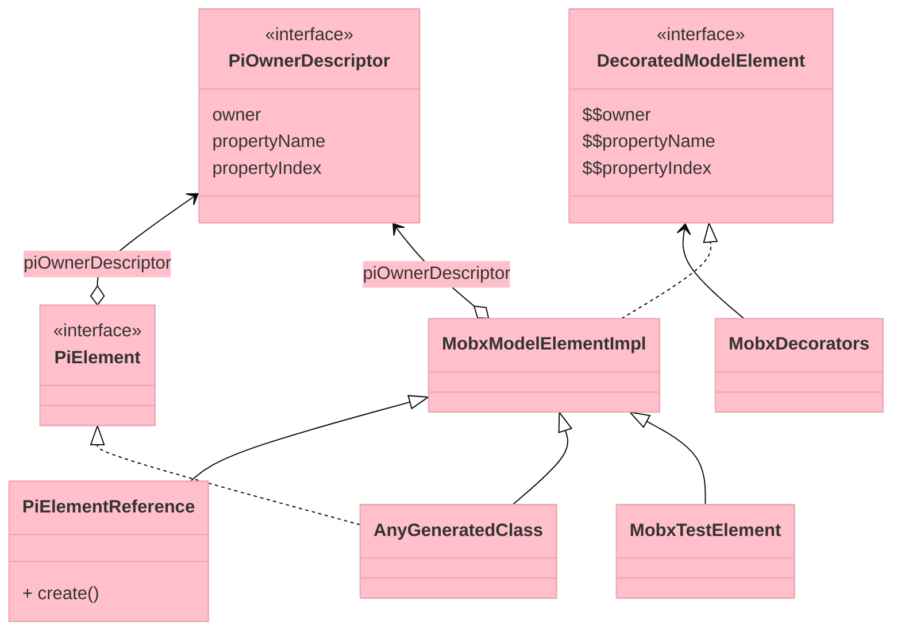
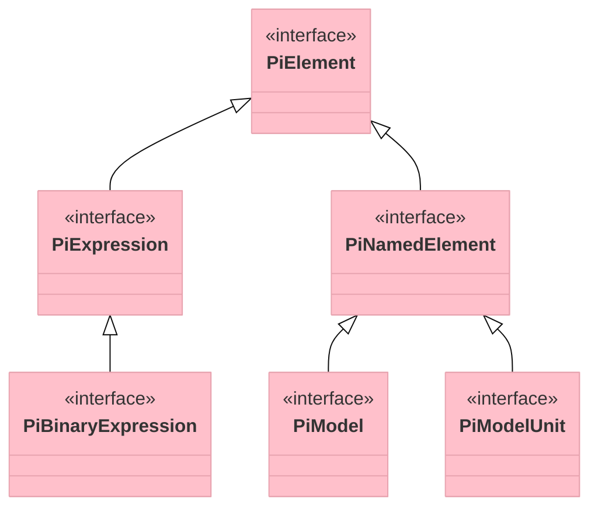

```mermaid
    %%{init: {'theme': 'base', 'themeVariables': { 'primaryColor': 'pink'}}}%%
    classDiagram 
    direction BT

    class PiElement{
        <<interface>>
    }
    class PiElementReference{
        + create<T extends PiNamedElement>()
    }

    class PiOwnerDescriptor{
        <<interface>>
        owner
        propertyName
        propertyIndex
    }
    class MobxModelElementImpl{
    }
    class DecoratedModelElement{
        <<interface>>
        $$owner
        $$propertyName
        $$propertyIndex
    }
    class MobxDecorators {
    }
    class AnyGeneratedClass {
    }
    class MobxTestElement {
    }
    PiElement o--> PiOwnerDescriptor: piOwnerDescriptor
    MobxModelElementImpl o--> PiOwnerDescriptor: piOwnerDescriptor
    MobxDecorators --> DecoratedModelElement
    MobxModelElementImpl ..|> DecoratedModelElement
    PiElementReference --|> MobxModelElementImpl
    
    AnyGeneratedClass --|> MobxModelElementImpl
    AnyGeneratedClass ..|> PiElement
    MobxTestElement --|> MobxModelElementImpl
    
```

```mermaid
    %%{init: {'theme': 'base', 'themeVariables': { 'primaryColor': 'pink'}}}%%
    classDiagram 
    direction BT
    class PiElement{
        <<interface>>
    }
    class PiBinaryExpression{
        <<interface>>
    }
    class PiExpression{
        <<interface>>
    }
    class PiModel{
        <<interface>>
    }
    class PiModelUnit{
        <<interface>>
    }
    class PiNamedElement{
        <<interface>>
    }
    PiBinaryExpression --|> PiExpression
    PiExpression --|> PiElement
    PiModel --|> PiNamedElement
    PiModelUnit --|> PiNamedElement
    PiNamedElement --|> PiElement
```
