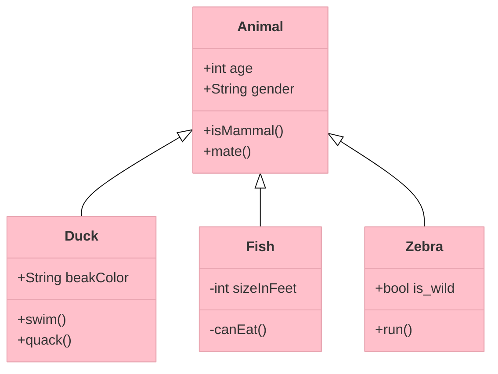
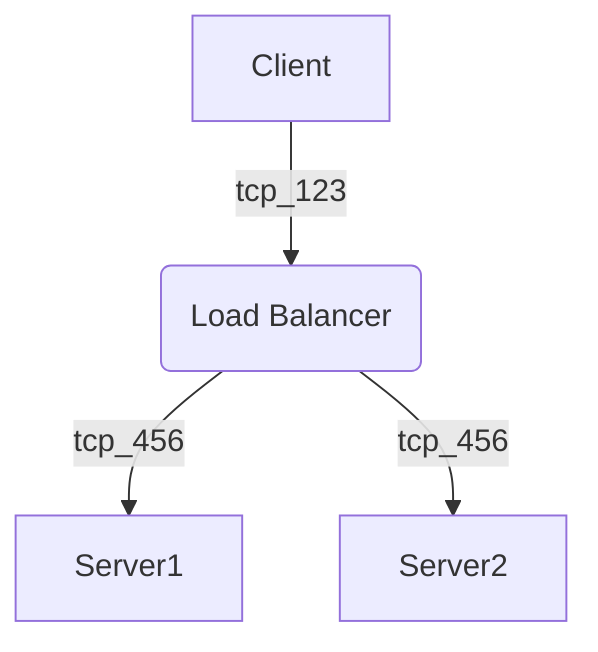

```mermaid
    %%{init: {'theme': 'base', 'themeVariables': { 'primaryColor': 'pink'}}}%%
    classDiagram
    Animal <|-- Duck
    Animal <|-- Fish
    Animal <|-- Zebra
    Animal : +int age
    Animal : +String gender
    Animal: +isMammal()
    Animal: +mate()
    class Duck{
    +String beakColor
    +swim()
    +quack()
    }
    class Fish{
    -int sizeInFeet
    -canEat()
    }
    class Zebra{
    +bool is_wild
    +run()
    }
```

And here is another:

```mermaid
    graph TD
    A[Client] -->|tcp_123| B
    B(Load Balancer)
    B -->|tcp_456| C[Server1]
    B -->|tcp_456| D[Server2]
```

