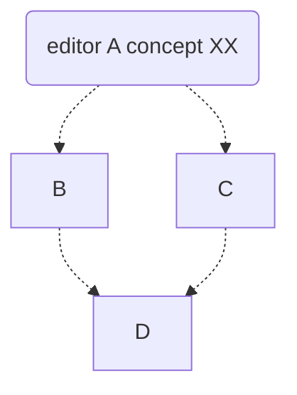

# Try-out editor info diagram

```mermaid
graph TD;
idA-XX(editor A concept XX)
idA-XX -.->B;
idA-XX-.->C;
B-.->D;
C-.->D;
```

```mermaid
graph TB
c1 --x a2
subgraph default
a1-->a2
end
subgraph manual
b1-->b2
end
subgraph tables
BaseProduct-->InsurancePart
end
```
