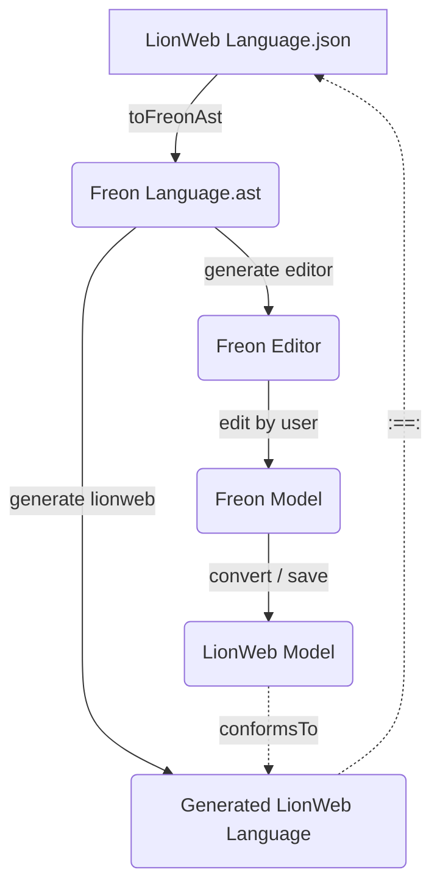

# Readme

This project contains the LionWeb and corresponding Freon language definitions for
the language to specify nmessages of the delta protocol.

This uses
- the LionWeb Language -> Freon Language converter from the lioncore-m3-feon repository
- the Freon Language -> LionQWeb Language generator which is part of Freon.

The overall flow is as follows.

You can either start with the Freon Language, or with the LionWeb Language,
the end result is the same.

Because Freon uses the LionWeb serialization format to store models,
the model created with Freon is already LionWeb compatible and conforms
to the LionWeb Language.

