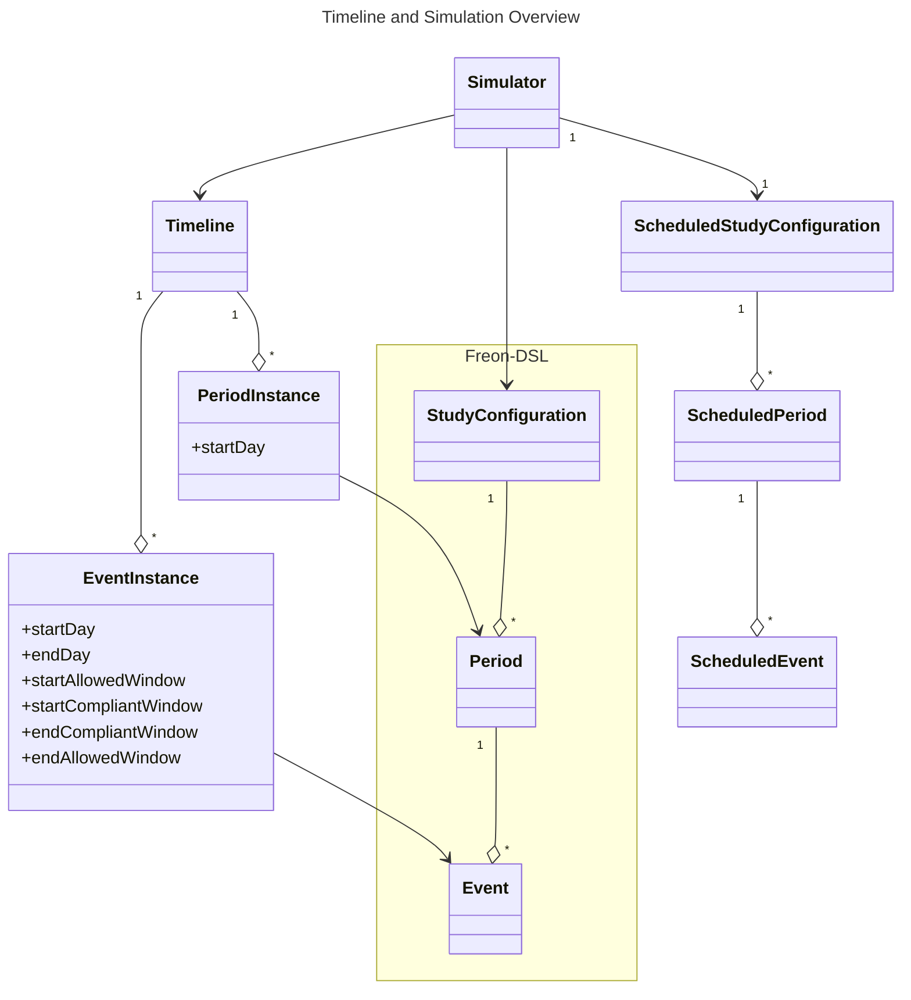

```mermaid
---
title: Timeline and Simulation Overview
---
classDiagram

PeriodInstance  -->  Period
class PeriodInstance {
  +startDay
}

EventInstance  -->  Event
class EventInstance {
  +startDay
  +endDay
  +startAllowedWindow
  +startCompliantWindow
  +endCompliantWindow
  +endAllowedWindow
}

Timeline "1" --o "*" PeriodInstance
Timeline "1" --o "*" EventInstance
Simulator  -->  Timeline
Simulator  -->  StudyConfiguration
Simulator "1" --> "1" ScheduledStudyConfiguration
ScheduledStudyConfiguration "1" --o "*" ScheduledPeriod
ScheduledPeriod "1" --o "*" ScheduledEvent

StudyConfiguration "1" --o "*" Period
Period "1" --o "*" Event


namespace Freon-DSL {
 class StudyConfiguration
 class Period
 class Event
}
```